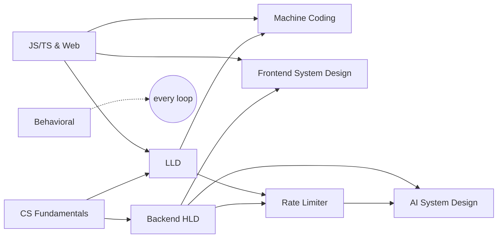

# interview-questions

A complete, from-scratch interview preparation curriculum for a **senior full-stack engineer (~6 YOE)** targeting **Senior Full-stack, Frontend, Backend, Agentic AI and Applied AI** roles at **FAANG/Big Tech, Indian product companies, AI-first companies and startups/remote teams**.

- **Language:** TypeScript everywhere (React for UI, SQL/Redis where needed)
- **Pace:** ~2 hours/day (14 hrs/week), no fixed deadline
- **Approach:** Everything is taught from first principles, as if you were new to it. Each roadmap goes **0 → 1** (foundations) and then **1 → 100** (interview core → senior depth → expert).

---

## The roadmaps

| # | Roadmap | What it covers | Sections | Hours (all levels) |
| --- | --- | --- | ---: | ---: |
| 1 | [JavaScript, TypeScript & Web Fundamentals](JS%20and%20Web%20Fundamentals/Roadmap.md) | JS language, event loop, TS type system, browser rendering, networking, security, React internals, Node.js, V8 | 28 | 141–176 |
| 2 | [CS Fundamentals](CS%20Fundamentals/Roadmap.md) | OS, concurrency, networking, databases/SQL, security, storage engines, distributed-systems primer | 22 | 106–131 |
| 3 | [Low-Level Design (LLD)](LLD/Roadmap.md) | OOP, SOLID, UML, all GoF patterns, problem families, concurrency, DDD, frontend and agentic LLD | 26 | 158–198 |
| 4 | [Machine Coding](Machine%20Coding/Roadmap.md) | JS utilities and polyfills, React UI builds, Flipkart-style backend builds, hard builds | 20 | 143–182 |
| 5 | [Backend System Design (HLD)](HLD/Roadmap.md) | Building blocks, data, caching, queues, consistency, consensus, reliability, 35+ case studies, multi-region | 31 | 192–242 |
| 6 | [Rate Limiter (deep dive)](HLD/Rate%20Limiter/rate-limiting-roadmap.md) | Every algorithm → Redis/Lua atomicity → cluster, failures, gateways → adaptive limits, LLM token budgets. Builds on your existing code | 27 | 97–129 |
| 7 | [Frontend System Design](Frontend%20System%20Design/Roadmap.md) | RADIO framework, rendering strategies, state, performance, offline, real-time, security, a11y, collaborative apps | 23 | 116–148 |
| 8 | [AI System Design (Agentic + Applied)](AI%20System%20Design/Roadmap.md) | LLM fundamentals, RAG, agents, MCP, evals, guardrails, LLM ops, serving, fine-tuning, ML system design | 25 | 152–192 |
| 9 | [Behavioral & Leadership](Behavioral/Roadmap.md) | Story bank, STAR, project deep dive, company-specific prep (Amazon LPs etc.), senior signals, negotiation | 16 | 42–59 |
| | **Total** | | **218** | **~1,150–1,460** |

> **Not covered:** DSA/LeetCode-style algorithms (by your choice). Most FAANG and many Indian product-company loops still include 1–2 DSA rounds, so plan for them separately if your target companies use them. Your `DSA/` folder is there for that.

> **Previous versions** of the LLD, HLD and Rate Limiter roadmaps (including edits that were never committed) are saved in [`_archive/previous-roadmaps/`](_archive/previous-roadmaps). Older committed versions are also in git history.

---

## How every roadmap is structured

**Levels** (the same meaning in every roadmap):

| Level | Meaning |
| --- | --- |
| **0 → 1** | Foundations: you understand the vocabulary and can do guided exercises |
| **1 → 10** | Interview core: you can pass a standard senior-level round on common problems |
| **10 → 50** | Senior depth: you handle deep follow-ups, failures and tradeoffs; strong senior hire |
| **50 → 100** | Expert/staff: internals, novel problems, leading the conversation |

**Every section has the same layout:**

| Part | What it gives you |
| --- | --- |
| **Time** | Focused hours including hands-on work |
| **Why it matters** | What interviewers are probing |
| **Prerequisites** | Sections to finish first (here or in other roadmaps) |
| **What you'll learn** | The complete topic list |
| **Hands-on** | Small TypeScript builds or experiments |
| **Interview questions** | Self-test after studying |
| **Resources** | One primary resource first; the rest are optional |
| **Pitfalls** | Common misconceptions and mistakes |
| **Checklist** | The concepts you should be able to explain after the section. Tick them off. |

Each roadmap also ends with an **interview playbook/rubric**, a **problem or case-study bank**, a **readiness checklist per level**, and **core resources**.

---

## How the roadmaps depend on each other



**Shared work (count it once):**
- The rate limiter is the same exercise in LLD-16, MC-13, HLD-16 and RL-17. Do it in the [Rate Limiter roadmap](HLD/Rate%20Limiter/rate-limiting-roadmap.md) and reuse it.
- LLD problem families (LLD-13 to LLD-16) become runnable builds in Machine Coding (MC-12, MC-13): design once, then implement.
- JSW-15 to JSW-22 are the theory behind Frontend System Design; FSD doesn't re-teach them.
- CSF-11, CSF-12 and CSF-18 are the theory behind HLD-09 to HLD-11.
- AI-14 (LLM gateway) reuses RL-25 (token budgets).

---

## Recommended study plan (2 hrs/day, 7 sessions/week)

The phases are ordered so that the **shared foundations come first**. Every target role needs them. Move to the next phase when its **gate** passes, not when the calendar says so.

| Phase | Focus | Roadmap sections | Approx. hours | Approx. weeks* | Gate to move on |
| --- | --- | --- | ---: | ---: | --- |
| **1. Foundations** | Language, CS basics, OOP, first utilities, career inventory | JSW Part A · CSF Part A · LLD Part A · MC Part A · BEH Part A | 174–222 | 12–16 | Level 1 checklist passed in JSW, CSF, LLD, MC, BEH |
| **2. Backend & full-stack core** | Design and build backend systems | LLD 1→10 · HLD 0→10 · RL 0→10 · CSF 1→10 · MC-08, MC-12, MC-13 · BEH 1→10 | ~265–335 | 19–24 | Level 10 in LLD, HLD, RL, CSF, BEH. **You can start backend/full-stack interviews here.** |
| **3. Frontend core** | JS depth, UI builds, frontend architecture | JSW 1→10 · MC-09 to MC-11 · FSD 0→10 | 142–176 | 10–13 | Level 10 in JSW, MC, FSD. **Frontend/full-stack interviews.** |
| **4. AI core** | LLM apps, RAG, agents, evals | AI 0→10 | 79–100 | 6–7 | Level 10 in AI. **Agentic/applied AI interviews.** |
| **5. Senior depth** (while interviewing) | Weakest areas first | 10→50 sections of every roadmap, ordered by your mock scores | 249–315 | ongoing | Level 50 in your primary track(s) |
| **6. Expert** | Long-term mastery | 50→100 sections | 227–299 | ongoing | Capstones done; staff-level mocks |

\*Weeks at 14 hrs/week. **Interview-ready for all five role types** (Phases 1–4) ≈ 660–830 focused hours, roughly **11–14 months** at 2 hrs/day. Backend/full-stack readiness arrives earlier (Phases 1–2, about 7–9 months).

**Want AI roles first?** Swap Phases 3 and 4. AI core only needs Phase 1 plus HLD Part A and HLD-12 from Phase 2.

**Test-out rule (optional, saves time):** Before starting a section, try its **interview questions** without studying. If you can answer all of them well *and* tick every checklist item, do only the hands-on exercise and move on. The estimates assume you're learning everything fresh. With 6 years of experience, some sections will go much faster.

### Weekly templates

| Session | Phase 1 | Phase 2 | Phase 3 | Phase 4 |
| --- | --- | --- | --- | --- |
| Mon | LLD | HLD concepts | JSW | AI concepts |
| Tue | JSW | LLD problem | FSD concepts | AI build |
| Wed | LLD | HLD concepts | MC UI build | AI concepts |
| Thu | CSF | Rate Limiter | FSD case study | AI build |
| Fri | MC utilities | LLD/MC backend build | MC UI build | AI case study |
| Sat | JSW or CSF | HLD case study (timed) | FSD case study (timed) | Maintenance mock (HLD/LLD/FSD) |
| Sun | Review day: recall checklists + 30 min Behavioral | Review + mock (rotate LLD/HLD/Behavioral) | Review + mock | Review + mock |

**Every session:** `10 min` recall → learn → hands-on → answer interview questions out loud → `5–10 min` notes and checklist ticks.

**Spaced repetition:** Revisit each finished section's checklist after ~2, 7 and 21 days. Only re-study the items you can't explain.

**Maintenance:** Once a roadmap reaches Level 10, keep one timed mock in it every 1–2 weeks so it doesn't decay while you study other tracks.

### Your first 14 sessions

| # | Session |
| --- | --- |
| 1 | LLD-01: delivery framework + 45-min baseline design (Library Management) |
| 2 | JSW-01 How JavaScript runs + start JSW-02 |
| 3 | LLD-02 OOP in TypeScript (part 1) |
| 4 | CSF-01 How a computer runs your program |
| 5 | LLD-02 (part 2): BankAccount, Money, Notifications labs |
| 6 | Finish JSW-02 + start JSW-03 (closures) |
| 7 | **Review day:** recall checklists · BEH-01 (1 h) · MC-01 templates set up |
| 8 | LLD-03 Relationships & UML |
| 9 | Finish JSW-03 |
| 10 | LLD-04 SOLID (part 1) |
| 11 | CSF-02 Processes & threads (part 1) |
| 12 | LLD-04 (part 2) |
| 13 | JSW-04 `this` + MC-02 debounce/throttle (start) |
| 14 | **Review day:** recall · BEH-02 career inventory (1 h) · update progress |

---

## Role-based targets

Use this to decide how deep to go in each roadmap for a specific role.

| Target role | Must reach Level 10 | Push to Level 50 | Nice to have |
| --- | --- | --- | --- |
| **Senior Backend** | CSF, LLD, HLD, RL, MC (tracks A + C), BEH | HLD, LLD, RL | AI to Level 1 |
| **Senior Full-stack** | JSW, CSF, LLD, HLD, RL, MC (all tracks), FSD, BEH | HLD *or* FSD | AI to Level 10 |
| **Senior Frontend** | JSW, MC (tracks A + B), FSD, BEH, LLD Part A + LLD-24 | JSW, FSD | HLD to Level 1 |
| **Agentic AI Engineer** | AI, HLD, LLD (+ LLD-25), MC (tracks A + C), RL (+ RL-25), BEH | AI (AI-09 to AI-18) | FSD-22 (AI UIs) |
| **Applied AI Engineer** | AI (including AI-19), HLD, CSF, MC (track A), BEH | AI (AI-12, AI-17, AI-19) | AI 50 → 100 |

---

## What different companies emphasize

| Company type | Typical loop | Where to focus |
| --- | --- | --- |
| **FAANG / Big Tech** | DSA (1–2 rounds) · system design (backend, or frontend for UI roles) · behavioral (e.g., Amazon LPs, Google GnL) · OOD at some companies | HLD / FSD, Behavioral (BEH-09), LLD for Amazon/Microsoft/Uber-style OOD, JSW + MC track A for frontend screens |
| **Indian product companies** (Flipkart, Swiggy, Razorpay, PhonePe, Atlassian India, Uber India…) | Machine coding (often heavy) · LLD · HLD · CS fundamentals · hiring-manager round | MC (tracks B + C), LLD, HLD, CSF, BEH-08/BEH-09 |
| **AI-first companies** | AI system design · practical AI coding (build a RAG/agent/tool-use app live) · evals/debugging exercises · general system design · mission/values | AI (especially AI-09 to AI-15, AI-21), HLD, MC track A, BEH-09 (mission) |
| **Startups / remote** | Take-homes or pairing on practical builds · pragmatic system design · ownership and communication | MC, HLD Part A + case studies, FSD for product roles, BEH-15 (async/written) |

---

## Tracking progress

Every checklist item is a Markdown checkbox (`- [ ]`). Tick it (`- [x]`) when you can explain the concept without notes. To see your progress from the repo root:

```bash
for f in */Roadmap.md "HLD/Rate Limiter/rate-limiting-roadmap.md"; do
  done=$(grep -c -- '- \[x\]' "$f"); total=$(grep -cE -- '- \[( |x)\]' "$f")
  printf "%-55s %4s / %-4s\n" "$f" "$done" "$total"
done
```

**Suggested repo layout as you work:** keep code and notes next to each roadmap, for example `LLD/problems/splitwise/`, `HLD/case-studies/chat.md`, `Machine Coding/ui/autocomplete/`, `AI System Design/capstone/`, `Behavioral/story-bank.md` (keep personal stories private if the repo is public).

---

## Study principles (apply them everywhere)

1. **Attempt before you read.** Design or code first, then compare with a reference and write down one thing it did better.
2. **Explain out loud.** Interviews are spoken. Answer every section's interview questions aloud.
3. **Evidence over recognition.** "I've read about it" isn't done. Done means you built it, tested it, or explained it without notes.
4. **Timed practice starts early.** Begin light mocks after each roadmap's Part A. Score yourself with the rubric at the end of each roadmap.
5. **One primary resource per topic.** Finish it before opening a second one.
6. **Fix the weakest dimension.** After each mock, redo the weakest part within 48 hours.
